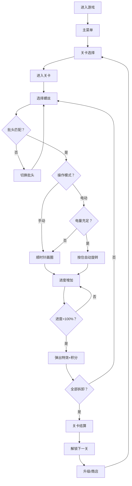

## 1. 产品概述

一款可以在浏览器中加载的解压向拆螺丝小游戏，玩家使用电动螺丝刀拆卸不同规格的螺丝，通过模拟真实物理反馈缓解压力。支持PC与移动端全平台兼容，提供闯关、升级、商店等丰富玩法。

- 核心目标：通过沉浸式拆卸体验缓解用户压力，提供即时正向反馈
- 目标用户：需要解压放松的全年龄段用户，通勤、午休等碎片时间玩家

## 2. 核心功能

### 2.1 功能模块总览
1. **游戏主界面**：螺丝拆卸玩法、工具切换、电动模式、进度反馈
2. **闯关模式**：关卡选择、计时挑战、连击系统、关卡递进
3. **升级系统**：电动转速、批头套装、电量上限升级
4. **商店系统**：螺丝刀皮肤、背景主题、特效皮肤购买
5. **设置与统计**：音效开关、数据统计、本地存档

### 2.2 页面详情

| 页面名称 | 模块名称 | 功能描述 |
|---------|---------|---------|
| 主菜单页 | 标题区域 | 游戏Logo、开始游戏按钮、设置按钮、商店按钮 |
| 主菜单页 | 快速入口 | 继续游戏、关卡选择、升级商店导航 |
| 关卡选择页 | 关卡网格 | 已解锁/未解锁关卡展示、星级评价、最佳时间 |
| 关卡选择页 | 进度概览 | 当前最高关卡、总积分、统计摘要 |
| 游戏对战页 | 游戏画布 | 螺丝木板场景、Canvas渲染、物理反馈 |
| 游戏对战页 | HUD面板 | 计时器、进度条、连击显示、积分显示、电量条 |
| 游戏对战页 | 工具栏 | 批头切换按钮、电动模式开关、暂停按钮 |
| 游戏对战页 | 结算弹窗 | 通关/失败结果、获得积分、连击数据、下一关按钮 |
| 升级商店页 | 升级面板 | 三项升级的当前等级、效果预览、积分消耗 |
| 升级商店页 | 皮肤商店 | 螺丝刀/背景/特效分类展示、解锁状态、预览效果 |
| 统计设置页 | 数据统计 | 累计螺丝数、总时长、最快记录、最高连击、最高关卡 |
| 统计设置页 | 设置面板 | 音效开关、音乐开关、震动开关、清档按钮 |

## 3. 核心流程

### 3.1 主流程描述
玩家进入主菜单 → 选择关卡 → 进入游戏 → 按顺序拆卸螺丝（支持手动画圈或电动模式）→ 完成拆卸获得积分与评价 → 解锁下一关 → 使用积分解锁升级与皮肤 → 循环闯关

### 3.2 拆卸流程
选择螺丝 → 匹配正确批头 → 按住鼠标/触摸 → 顺时针画圈/电动旋转 → 进度条增长、螺丝上升 → 进度100%触发弹出特效 → 获得积分 → 拆卸下一颗

### 3.3 流程图

## 4. 用户界面设计

### 4.1 设计风格

- **美学方向**：工业质感 + 解压柔和，拟物化螺丝渲染搭配现代玻璃态UI
- **主色调**：深橡木棕 `#5D4037` 作为背景主色，搭配金属银灰 `#BDBDBD` 和暖橙 `#FF9800` 强调色
- **辅助色**：进度绿 `#4CAF50`、危险红 `#F44336`、信息蓝 `#2196F3`
- **按钮风格**：圆角8px，轻微投影，悬浮态放大1.03倍，按下态内凹阴影
- **字体方案**：标题使用 `Orbitron` 工业风字体，正文使用 `Noto Sans SC` 现代无衬线
- **布局风格**：游戏区沉浸式全屏，UI面板玻璃态半透明悬浮，卡片式模块
- **图标风格**：线性+填充混合，2px圆角图标，螺丝拟物渲染

### 4.2 页面设计概览

| 页面名称 | 模块名称 | UI元素设计 |
|---------|---------|-----------|
| 主菜单页 | 标题区域 | 大号游戏名+金属质感Logo，呼吸发光动画，按钮悬浮微弹 |
| 关卡选择页 | 关卡网格 | 圆形关卡徽章，已解锁发光，未解锁灰色加锁，三星评级展示 |
| 游戏对战页 | 游戏画布 | 木纹纹理背景，螺丝3D拟物渲染，螺丝刀跟随光标 |
| 游戏对战页 | HUD面板 | 顶部玻璃态条：左计时器、中连击数、右积分；底部电量条+工具栏 |
| 游戏对战页 | 结算弹窗 | 居中模态，大字体结果，积分数字滚动动画，按钮脉冲 |
| 升级商店页 | 升级面板 | 三列卡片，等级进度条，升级按钮脉冲提示 |
| 升级商店页 | 皮肤商店 | Tab切换，网格卡片，已拥有勾标，当前使用高亮 |
| 统计设置页 | 数据统计 | 数值卡片+图标，数字动效，柱状图展示关卡最佳时间 |

### 4.3 响应式设计

- **设计策略**：桌面端优先，移动端自适应
- **断点设计**：≥1024px 桌面布局，768-1023px 平板布局，<768px 手机布局
- **触摸优化**：移动端按钮最小48x48px，触控反馈震动，画圈识别优化触摸轨迹
- **画布自适应**：Canvas按比例缩放，保持场景宽高比，螺丝大小自适应
- **工具栏位置**：移动端工具栏移入底部抽屉，避免遮挡游戏区

### 4.4 视觉动效指引

- **螺丝颤动**：旋转时螺丝沿Z轴1-2px高频颤动
- **进度光效**：进度25%/50%/75%触发环形闪光
- **弹出特效**：螺丝完成时垂直弹起+旋转，粒子爆散，屏幕轻微震动
- **连击动画**：连击数增加时数字弹跳放大，颜色渐变（白→黄→橙→红）
- **页面过渡**：滑入滑出+渐隐，时长300ms ease-out
