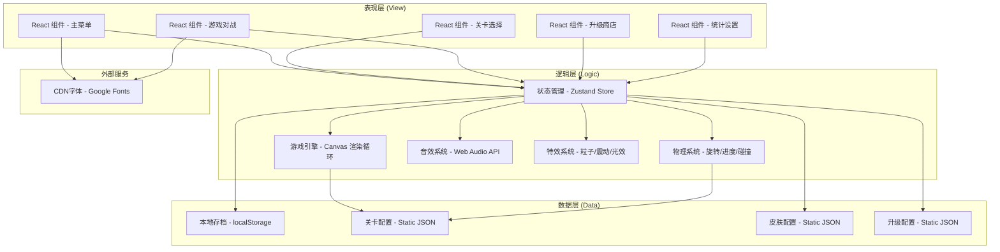

## 1. 架构设计



## 2. 技术描述

- **前端框架**：React@18 + TypeScript
- **构建工具**：Vite@5（极速启动、HMR热更新）
- **样式方案**：TailwindCSS@3 + CSS Modules（组件级样式隔离）
- **状态管理**：Zustand@4（轻量级、极简API、持久化中间件）
- **游戏渲染**：HTML5 Canvas 2D（高性能60fps渲染）
- **音效系统**：Web Audio API（程序化合成音效，无需音频文件）
- **动画库**：Framer Motion（React组件动画、页面过渡）
- **数据持久化**：localStorage + Zustand Persist 中间件
- **图标方案**：Lucide React（现代线性图标库，轻量可定制）

## 3. 路由定义

| 路由路径 | 页面组件 | 功能用途 |
|---------|---------|---------|
| `/` | `MainMenu` | 游戏主菜单，入口页 |
| `/levels` | `LevelSelect` | 关卡选择页面 |
| `/game/:levelId` | `GamePlay` | 游戏对战核心页面 |
| `/shop` | `Shop` | 升级系统与皮肤商店 |
| `/settings` | `Settings` | 统计数据与设置面板 |

## 4. 数据模型

### 4.1 核心数据结构

```typescript
// 螺丝类型
type ScrewType = 'cross' | 'flat' | 'hex' | 'socket'

// 螺丝对象
interface Screw {
  id: string
  type: ScrewType
  x: number          // 木板上的X坐标（百分比 0-100）
  y: number          // 木板上的Y坐标（百分比 0-100）
  size: number       // 螺丝尺寸 1-3
  progress: number   // 拆卸进度 0-100
  order: number      // 拆卸顺序
  removed: boolean   // 是否已拆卸
}

// 关卡配置
interface LevelConfig {
  id: number
  name: string
  screwCount: number
  screwTypes: ScrewType[]
  timeLimit: number       // 秒
  targetScore: number
  unlocked: boolean
  bestTime?: number
  stars?: 0 | 1 | 2 | 3
}

// 升级项
interface Upgrade {
  id: 'motorSpeed' | 'bitSet' | 'batteryMax'
  name: string
  description: string
  maxLevel: number
  currentLevel: number
  baseCost: number
  costMultiplier: number
}

// 皮肤项
interface Skin {
  id: string
  category: 'screwdriver' | 'background' | 'particle'
  name: string
  price: number
  owned: boolean
  equipped: boolean
  config: Record<string, any>
}

// 游戏统计
interface Statistics {
  totalScrews: number
  totalPlayTime: number      // 秒
  fastestScrew: number       // 秒
  highestCombo: number
  highestLevel: number
  levelBestTimes: Record<number, number>
}

// 全局游戏状态
interface GameState {
  coins: number
  currentLevel: number
  upgrades: Upgrade[]
  skins: Skin[]
  statistics: Statistics
  settings: {
    soundEnabled: boolean
    musicEnabled: boolean
    vibrationEnabled: boolean
  }
}
```

### 4.2 Zustand Store 切片设计

- `gameStore`: 游戏运行时状态（当前螺丝、连击、计时、电量）
- `progressStore`: 全局进度、升级、皮肤、统计、存档持久化
- `uiStore`: UI状态（弹窗、页面过渡、Toast）

## 5. 核心模块设计

### 5.1 游戏引擎模块 (`src/game/`)
- `GameEngine.ts`: 主循环 (requestAnimationFrame)，协调渲染与逻辑
- `ScrewRenderer.ts`: Canvas螺丝拟物绘制（4种螺丝头、金属质感、光影）
- `RotationDetector.ts`: 鼠标/触摸轨迹分析，计算顺时针角度
- `PhysicsSimulator.ts`: 螺丝上升、颤动、弹出物理模拟
- `ParticleSystem.ts`: 粒子特效系统（火花/星光/彩虹）

### 5.2 音效模块 (`src/audio/`)
- `AudioManager.ts`: Web Audio封装，振荡器合成各类音效
  - 旋转声：白噪音+滤波器，频率随转速变化
  - 咔哒声：短促方波脉冲
  - 弹出声：正弦波频率扫频
  - BGM：Lo-fi循环，多音轨叠加

### 5.3 工具模块 (`src/utils/`)
- `storage.ts`: localStorage读写封装，带错误处理
- `math.ts`: 向量运算、角度计算、插值函数
- `responsive.ts`: 自适应布局工具

## 6. 性能优化

- **渲染优化**：Canvas脏矩形渲染，仅重绘变化区域
- **内存管理**：粒子对象池复用，避免GC抖动
- **事件节流**：鼠标/触摸事件RAF节流，稳定60fps
- **首屏优化**：路由懒加载，动态import拆分代码块
- **资源优化**：程序化生成所有视觉资源，零图片依赖

## 7. 浏览器兼容

- 目标浏览器：Chrome 90+、Firefox 88+、Safari 14+、Edge 90+、iOS Safari 14+、Android Chrome 90+
- 特性检测：Web Audio API、Canvas、localStorage、requestAnimationFrame
- 降级方案：不支持的特性给出友好提示，核心玩法保证可用
